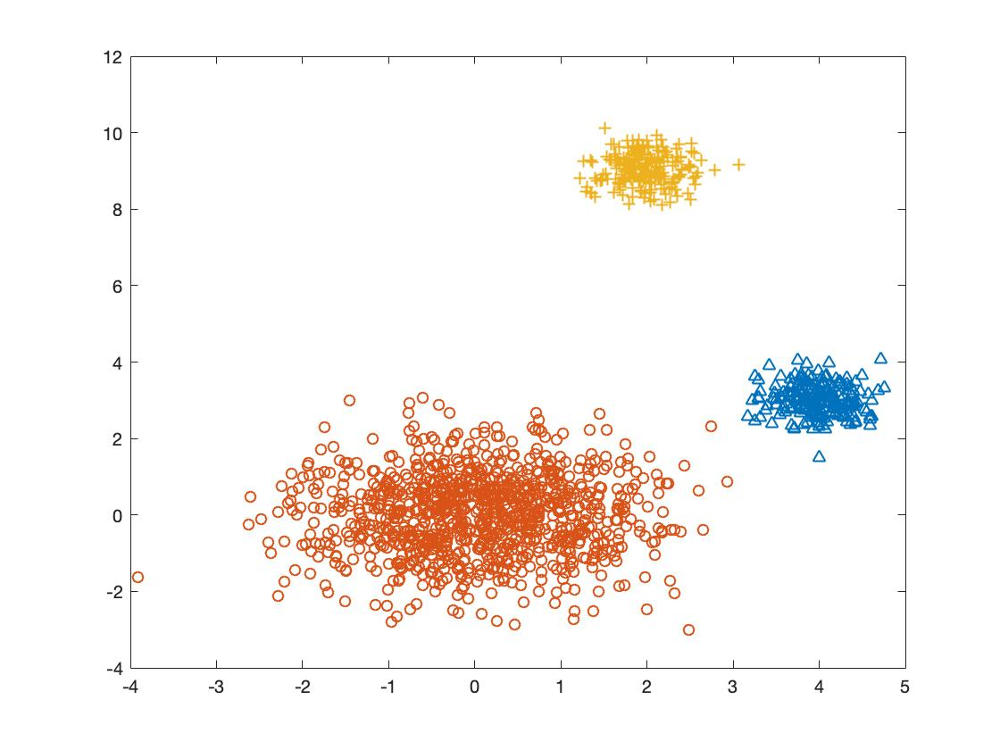
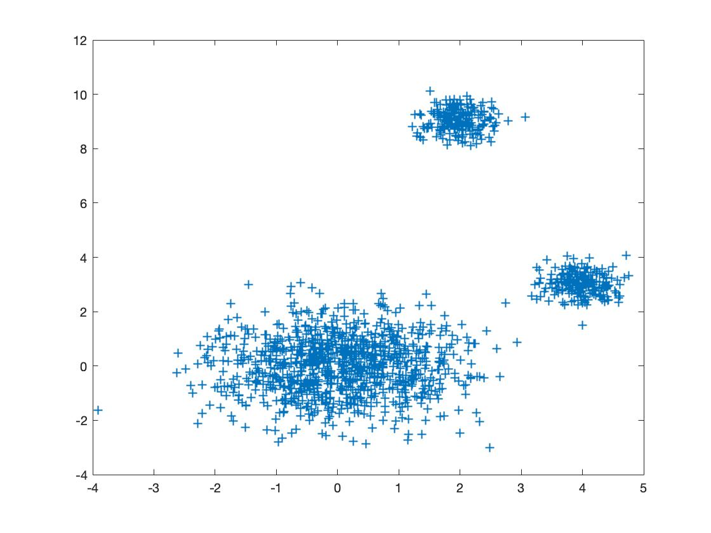
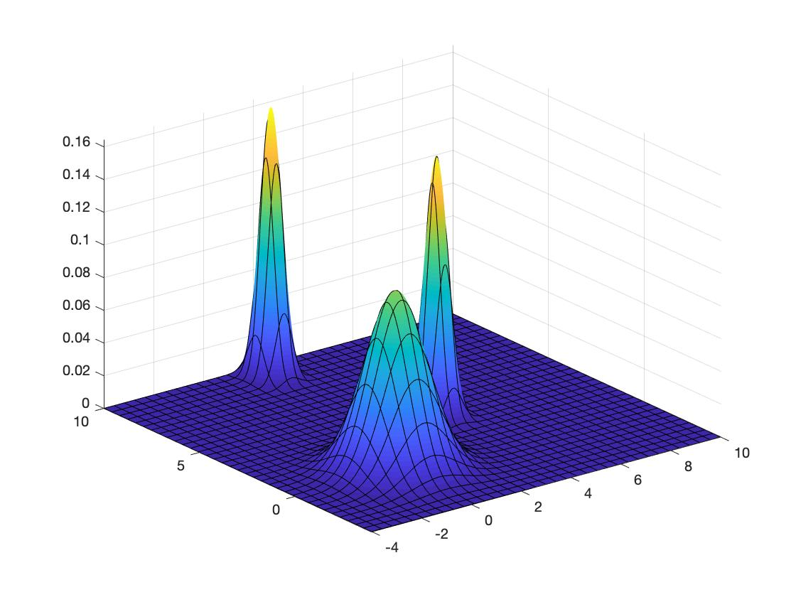

# Expectation_Maximization_algorithm
Just a general expectation maximization (EM) algorithm (motivated by image processing applications)

The algorithm uses a Gaussian Mixture distribution (GMM) of K mixands. 
It takes as inputs the number of mixands, a matrix (its columns 
are the collected data points) and the number of iterations needed 
for achieving an expected level of matching. The K-menas it is utilized as 
a preprocessig unit in order to coarsly create some intial estimates for the means and 
covariances of the GMM. The algorithm outputs the means and covariances of the GMM model. 

As a working example we deploy three independent Gaussian random vectors 
on the plane and we try to cluster them by using EM. 

   

   

   

